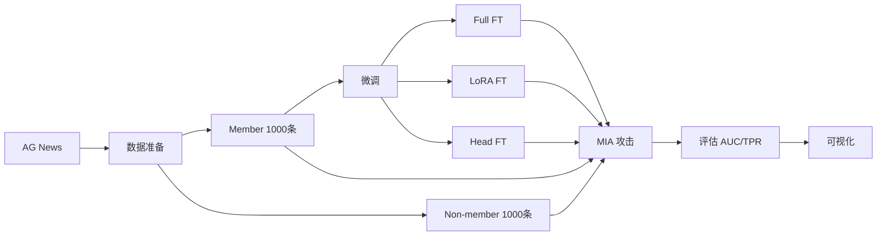

# MIA 实验项目

**评估微调大语言模型中的成员推断风险**  
*Evaluating Membership Inference Risks in Fine-tuned Large Language Models*

---

## 📁 项目结构

```
final/
├── data/                          # 数据集
│   ├── raw/                      # 原始数据
│   └── processed/                # 处理后的数据
│       ├── member_train.jsonl    # 成员训练集
│       ├── nonmember.jsonl       # 非成员集
│       └── split_indices.json    # 划分索引
├── models/                        # 微调模型
│   ├── cache/                    # 模型缓存
│   ├── pythia-70m-full/          # Full FT 模型
│   ├── pythia-70m-lora/          # LoRA FT 模型
│   └── pythia-70m-head/          # Head FT 模型
├── results/                       # 实验结果
│   ├── scores/                   # 攻击得分
│   ├── metrics/                  # 评估指标
│   └── plots/                    # 可视化图表
├── scripts/                       # 主要脚本
│   ├── data_preparation.py       # 数据准备
│   ├── train.py                  # 模型微调
│   ├── attack.py                 # MIA 攻击
│   └── evaluate.py               # 结果评估
├── config/                        # 配置文件
│   └── config.py                 # 实验配置
├── notebooks/                     # Jupyter notebooks
├── requirements.txt               # Python 依赖
├── 研究规格说明.md                 # 研究规格文档
└── README.md                      # 本文件
```

---

## 🚀 快速开始

### 1. 安装依赖

```bash
pip install -r requirements.txt
```

### 2. 数据准备

```bash
python scripts/data_preparation.py
```

**输出**:
- `data/processed/member_train.jsonl` (1000条)
- `data/processed/nonmember.jsonl` (1000条)
- `data/processed/split_indices.json`

### 3. 模型微调

**Full Fine-tuning:**
```bash
python scripts/train.py --strategy full
```

**LoRA Fine-tuning:**
```bash
python scripts/train.py --strategy lora
```

**Head Fine-tuning:**
```bash
python scripts/train.py --strategy head
```

每个策略会保存 5 个 epoch 的检查点。

### 4. MIA 攻击

**示例：对 Full FT Epoch 5 进行 Loss-based 攻击**
```bash
python scripts/attack.py \
    --model_path models/pythia-70m-full/checkpoint-XXX \
    --attack loss \
    --output_name full_epoch5_loss
```

**三种攻击方法：**
- `loss`: Loss-based Attack
- `mink`: Min-K% Probability Attack
- `ratio`: Ratio Attack (需要预训练模型作为参考)

### 5. 结果评估

```bash
python scripts/evaluate.py \
    --score_files results/scores/full_epoch1_loss.json results/scores/full_epoch5_loss.json \
    --names "Full-Epoch1" "Full-Epoch5" \
    --output_prefix full_comparison
```

**输出**:
- `results/metrics/full_comparison_metrics.json`
- `results/plots/full_comparison_roc.png`
- `results/plots/full_comparison_auc_comparison.png`

---

## ⚙️ 配置说明

主要配置在 `config/config.py` 中：

| 参数 | 默认值 | 说明 |
|------|--------|------|
| `MODEL_NAME` | `EleutherAI/pythia-70m` | 使用的模型 |
| `MEMBER_TRAIN_SIZE` | 1000 | 成员训练集大小 |
| `NONMEMBER_SIZE` | 1000 | 非成员集大小 |
| `MAX_LENGTH` | 128 | 最大序列长度 |
| `BATCH_SIZE` | 4 | 批大小 |
| `NUM_EPOCHS` | 5 | 训练轮数 |
| `LEARNING_RATE` | 2e-5 | 学习率 |
| `LORA_R` | 8 | LoRA rank |
| `MINK_PERCENT` | 10 | Min-K% 攻击的 K 值 |

---

## 📊 实验流程



---

## 📈 预期成果

1. **模型检查点**: 每个微调策略 × 5 个 epoch = 15 个检查点
2. **攻击得分**: 每个检查点 × 3 种攻击方法 = 45 组攻击结果
3. **评估指标**: AUC-ROC, TPR @ 1% FPR
4. **可视化图表**:
   - ROC 曲线对比
   - AUC 随 epoch 变化曲线
   - 不同微调策略对比

---

## 🎯 研究问题 (RQ)

1. **RQ1**: 不同微调策略（Full/LoRA/Head）是否导致不同程度的 MIA 风险？
2. **RQ2**: MIA 风险是否随训练 epoch 增加而"涌现"？
3. **RQ3**: 参数高效微调（LoRA, Head）是否比 Full FT 更安全？

---


## 📚 参考文献

1. Carlini, N., et al. (2022). Membership Inference Attacks From First Principles.
2. Yeom, S., et al. (2018). Privacy Risk in Machine Learning.
3. Shokri, R., et al. (2017). Membership Inference Attacks Against ML Models.


