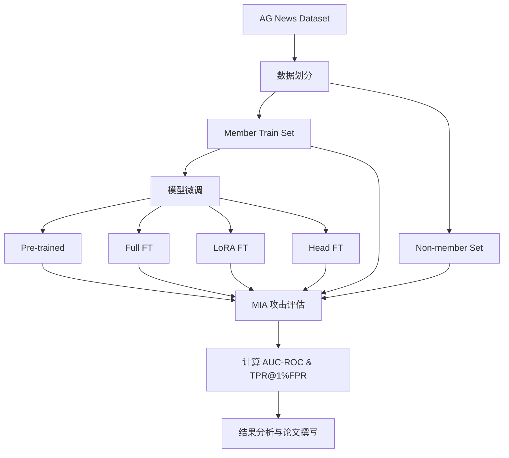

# 评估微调大语言模型中的成员推断风险
## Evaluating Membership Inference Risks in Fine-tuned Large Language Models

---

## 一、背景说明（Background & Motivation）

随着大语言模型（LLM）在医疗、金融和企业内部等高敏感场景中的广泛应用，模型通常会在本地部署，并使用机构内部的私有文本数据进行微调（fine-tuning），以适配具体业务需求。

在此类场景下，模型参数与训练数据不会对外公开，外部攻击者通常无法直接访问模型内部的损失函数或训练过程，因此这类系统在直觉上被认为具有较高的隐私安全性。然而，已有研究表明，**即使仅通过模型输出分布，攻击者仍可能推断某条数据是否被用于模型训练**，即**成员推断攻击（Membership Inference Attack, MIA）**。

本项目不以"现实黑客攻击"为直接目标，而是从**模型拥有者与内部安全评估者的视角**出发，在可控实验环境中系统分析：

- 不同微调策略是否会在模型输出中引入可区分成员与非成员的统计差异
- 不同模型规模与微调方式对 MIA 风险的影响程度
- 这些风险对现实部署（如企业或医院内部 LLM 系统）的安全启示

**本研究属于隐私风险评估（privacy auditing），而非攻击工具开发。**

---

## 二、实验对照设计（模型状态）

为分析微调策略对成员推断风险的影响，在相同模型架构与同分布数据条件下，构造以下模型状态进行对照实验：

### 模型状态（Model Variants）

#### 1. Pre-trained（Baseline）
- 使用原始预训练模型，不进行任何微调
- 作为成员推断攻击的基线对照

#### 2. Full Fine-tuning（Full FT）
- 对模型全部参数进行微调
- 仅在小规模模型上实施（受算力限制）

#### 3. LoRA Fine-tuning（LoRA FT）
- 使用低秩适配（LoRA）进行参数高效微调
- 适用于中等规模模型

#### 4. Head Fine-tuning（Head FT）
- 冻结 Transformer 主体，仅训练输出层（LM Head）
- 用于分析"参数少 ≠ 隐私更安全"的情况

### 对照矩阵（最小可实现版本）

| 模型规模 | Pre-trained | Full FT | LoRA FT | Head FT |
|---------|-------------|---------|---------|---------|
| **小模型** | ✓ | ✓ | ✓ | ✓ |
| **中等模型** | ✓ | - | ✓ | ✓ |

---

## 三、模型选择（Model Selection）

### 模型家族
**EleutherAI Pythia 系列**（HuggingFace 提供）

### 具体模型

#### 小模型（用于 Full FT / LoRA FT / Head FT）
- `EleutherAI/pythia-14m`
- `EleutherAI/pythia-31m`
- `EleutherAI/pythia-70m`

#### 中等模型（用于 LoRA / Head FT）
- `EleutherAI/pythia-160m`
- `EleutherAI/pythia-410m`

### 统一设置（避免引入额外变量）
- **Tokenizer**: 模型原生 tokenizer
- **最大序列长度**: 128（优先保证稳定性）
- **精度**: FP16（必要时启用 gradient checkpointing）
- **随机种子**: 固定 seed = 42

---

## 四、数据集选择（Dataset Selection）

### 使用数据集
**AG News**

### 选择理由
- 文本长度适中，适合语言建模微调
- 数据规模可控，适合在有限显存条件下反复实验
- 在多篇 LLM MIA 研究中被用作微调与攻击评估基准
- 可作为"企业内部通用文本数据"的公开替代

### 数据使用方式
- **不进行任务分类训练**，仅将文本视为语言模型输入
- **输入格式**: 将新闻标题与正文拼接为单一文本序列

---

## 五、数据划分（严格保证同分布）

### 核心原则
成员（member）与非成员（non-member）样本**必须来自相同数据分布**，避免因领域差异或分布漂移导致虚假的攻击成功率。

### 严格划分流程

1. 使用 AG News 官方 `train` split
2. 随机抽取一部分样本作为微调训练集 `D_member_train`
3. 从同一 `train` split 的剩余样本中，随机抽取等量样本作为 `D_nonmember`
4. **不使用官方 `test` split** 作为 non-member（避免潜在分布差异）

### 控制要求
- ✓ 成员与非成员样本数量相同（balanced）
- ✓ 文本长度分布相近（可按长度分桶后再抽样）
- ✓ 固定随机种子并保存样本索引，保证可复现

### 输出文件建议
```
data/
  ├── member_train.jsonl
  ├── nonmember.jsonl
  └── split_indices.json
```

---

## 六、成员推断攻击（MIA）实现

### 攻击目标
给定一条文本 x，攻击者基于模型输出计算一个 **membership score**，用于判断该文本是否出现在微调训练集中。

**所有攻击方法统一输出**:
```
score(x) ∈ ℝ （数值越大，越可能是成员）
```

### 攻击方法 1：Loss-based Attack

#### 思想
模型通常会对训练样本产生更低的负对数似然（NLL）。

#### 实现
1. 对文本进行 next-token prediction
2. 计算平均 NLL
3. 定义：
   ```
   score_loss(x) = - NLL(x)
   ```

### 攻击方法 2：Min-K% Probability Attack

#### 思想
非成员文本更容易包含模型极度不确定的 token，而成员文本中这类 token 更少。

#### 实现
1. 计算每个 token 的 log-probability
2. 选取 log-probability 最低的 K%（如 10%）
3. 对这些 token 的 log-probability 求平均：
   ```
   score_mink(x) = mean(bottom_K_percent(log_probs))
   ```

### 攻击方法 3：Ratio Attack（参考模型校准）

#### 思想
通过比较"微调模型"与"预训练模型"对同一文本的拟合程度，消除文本本身难度的影响。

#### 实现
- **参考模型**: Pre-trained model
- **目标模型**: Fine-tuned model
- 定义：
  ```
  score_ratio(x) = NLL_pretrained(x) - NLL_finetuned(x)
  ```

---

## 七、评估指标（Evaluation Metrics）

### 1. AUC-ROC
- 使用 member / non-member 的 score 与真实标签计算
- **解释标准**:
  - AUC ≈ 0.5：接近随机猜测
  - AUC ≥ 0.8：表明显著隐私泄露风险

### 2. TPR @ 1% FPR
- 从 ROC 曲线中取 FPR ≤ 0.01 时对应的最大 TPR
- 用于评估"低误报条件下的攻击有效性"
- 符合安全与隐私研究的常用评估方式

---

## 八、研究定位说明（供写论文使用）

> **重要说明**：本项目并不假设现实攻击者能够直接访问模型损失或参数。实验结果应被理解为：
> 
> *在理想化评估条件下，不同微调策略是否会在模型输出分布中引入可被利用的成员信号。*
> 
> 这些结果为现实世界中的黑盒攻击研究与安全微调策略设计提供了基础性依据。

---

## 附录：实验流程概览



---

## 参考资料（待补充）

1. Carlini, N., et al. (2022). Membership Inference Attacks From First Principles.
2. Yeom, S., et al. (2018). Privacy Risk in Machine Learning: Analyzing the Connection to Overfitting.
3. Shokri, R., et al. (2017). Membership Inference Attacks Against Machine Learning Models.
4. [其他相关文献...]

---

**文档版本**: v1.0  
**创建日期**: 2025年12月17日  
**最后更新**: 2025年12月17日

